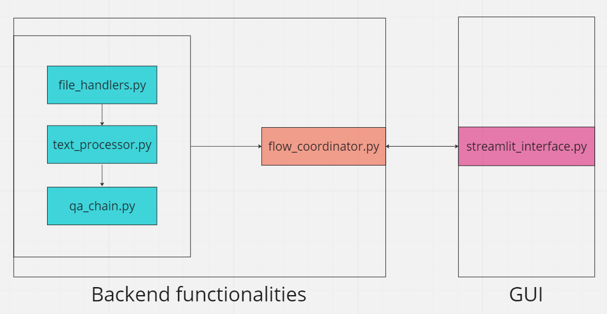

# Talk With Your Files (LLM(Langchain), GUI(Streamlit))

## Description
Talk-With-Your-Files is an open source GUI (Graphical User Interface) application powered by LLMs (Large Language Models). It allows you to ask questions about your PDF, DOCX, CSV, or TXT files and get relevant answers.

It is not dependent on any specific framework, as long as the underlying logics are provided it will work as it is.
Current frameworks in use:
Langchain - Handle LLM integration & processing texts.
Streamlit - Prepare the GUI

## Installation
1. Clone the repository: `git clone https://github.com/your-username/Talk-With-Your-Files.git` or by using the GitHub Desktop app.
2. Install the required dependencies: `pip install -r requirements.txt` (ideally in a virtual environment)
3. Create a .env file in the directory specifying your OpenAI API key as showned in the .env.example file.

## Usage
1. Open the TalkWithYourFiles subdirectory: `cd TalkWithYourFiles`
2. Run the application: `streamlit run streamlit_interface.py`
3. Wait for the application to run on your browser.
4. Upload your files and enter your question in the provided fields.
5. Wait for the response to be generated & check out your terminal to see the cost.

## Tips
1. Check individual modules for further documentation.
2. LLM model to be used can be changed easily by modifying the qa_chain.py file.
3. New files to be supported can be integrated into the app by modifying the file_handlers.py
4. To use another GUI framework, create your application based on your needs, and import the run function from the flow_coordinator.py
5. To use another methods to integrate LLMs, modify the qa_chain.py and make sure to implement the QAChainRunner class with the same methods.

## Contributing
Contributions are welcome! If you find any issues or have suggestions for improvements, please create a new issue or submit a pull request.
Some points to improve/add in in the future:
1. Database integration
2. Allowing other type of file extensions.
3. Allowing multimodality by processing non-text inputs into text data.

## License
This project is licensed under the [MIT License](LICENSE).

## Diagrams

