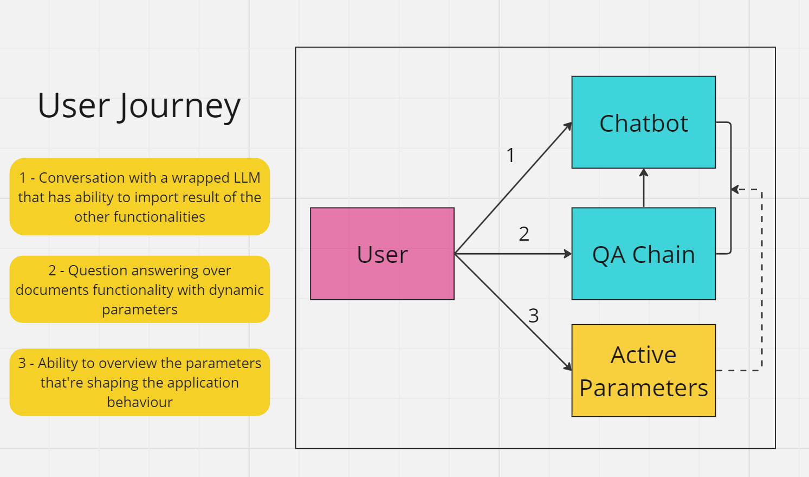
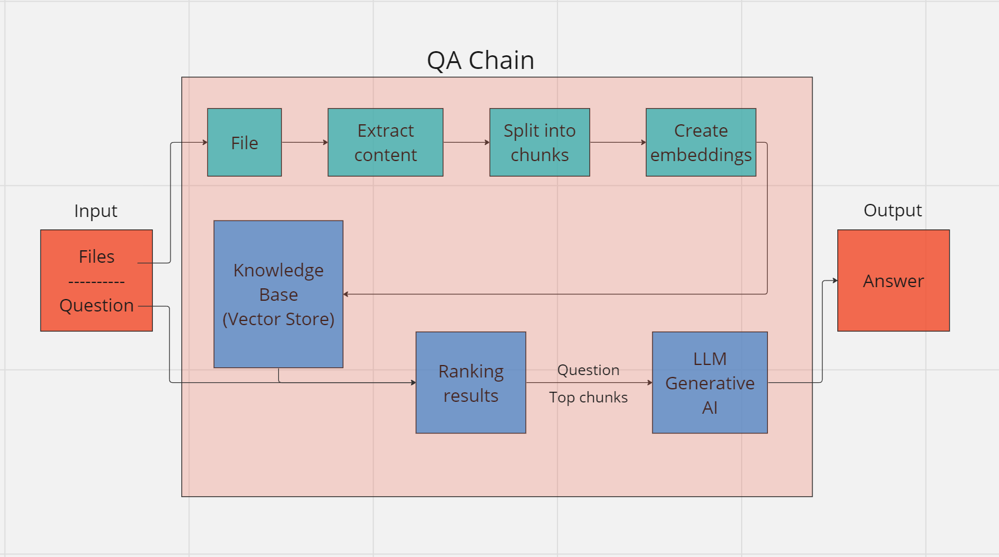
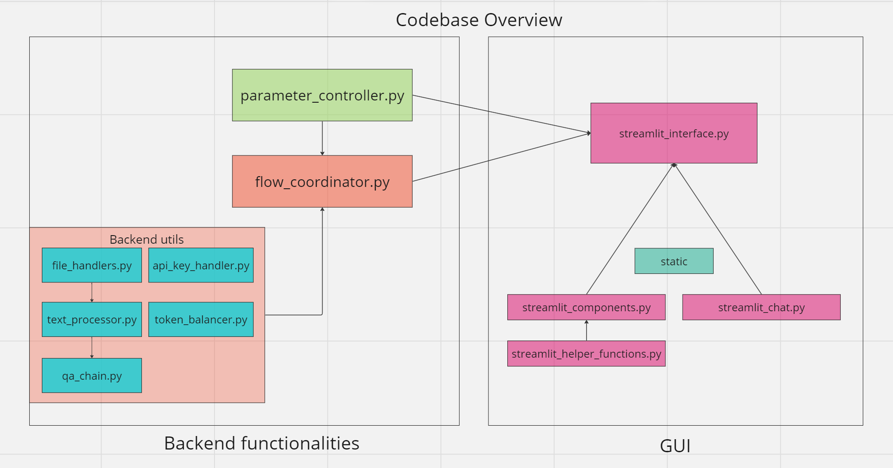

# Talk With Your Files (LLM(Langchain), GUI(Streamlit))

## Description
Talk-With-Your-Files is an open source GUI (Graphical User Interface) application powered by LLMs (Large Language Models). The aim is to allow interactions with files in ways that were not possible before and taking steps towards making everything open source. 

The demo production environment can be found here: https://twyf.safakan.com/

### Functionalities

- Question your files (PDF, DOCX, CSV, TXT) and choose to integrate results into the chatbot.
- Conversation with an LLM.
- Tweak the qa chain behaviour with dynamic parameters & monitor within GUI.
- Monitor conversation history (Summary Memory)

It is not dependent on any specific framework, as long as the underlying logics are provided it will work as it is.

Current frameworks in use:
- Langchain - Handle LLM integration & processing texts.
- Streamlit - Prepare the GUI

### Limitations
- Currently uses OpenAI API only, but the next update will introduce integration open source models such as LLama2, mpt-7b, ...
- While the QA Chain has dynamic parameters, the parameters of the chat functionality are static and will also be sorted in the next update.
  
## Installation

1. Clone the repository: `git clone https://github.com/Safakan/TalkWithYourFiles.git` or by using the GitHub Desktop app.
2. Install the required dependencies: `pip install -r requirements.txt` (ideally in a virtual environment)

OR
1. Create a docker container using the Dockerfile.
   
## Usage
1. Open the TalkWithYourFiles subdirectory: `cd TalkWithYourFiles`
2. Run the application: `streamlit run streamlit_interface.py`
3. Wait for the application to run on your browser.
4. Authenticate yourself on the sidebar with your api key.
5. Start getting answers to your questions!

OR
1. Test/use the app in the demo production environment.

## Process Diagrams

## Tips
1. Check individual modules for further documentation. 
2. LLM model to be used can be changed on the GUI or by setting different parameters in parameter_controller.
3. New files to be supported can be integrated into the app by modifying the file_handlers.py
4. To use another GUI framework, create your application based on your needs, and import the functions you need. (e.g. run function from the flow_coordinator.py for the QA chain)
5. Flow Coordinator doesn't own any of the actual implementation and dependent on lower level modules. Make sure to modify & support the app based on your usage requirements. 

## Contributing
Contributions are welcome! If you find any issues or have suggestions for improvements, please create a new issue or submit a pull request.
Some points to improve/add in in the future:
1. Integrating Open Source LLMs.
2. Allowing other type of file extensions.
3. Allowing multimodality by processing non-text inputs into text data.
4. Database integration

## License
This project is licensed under the [MIT License](LICENSE).

